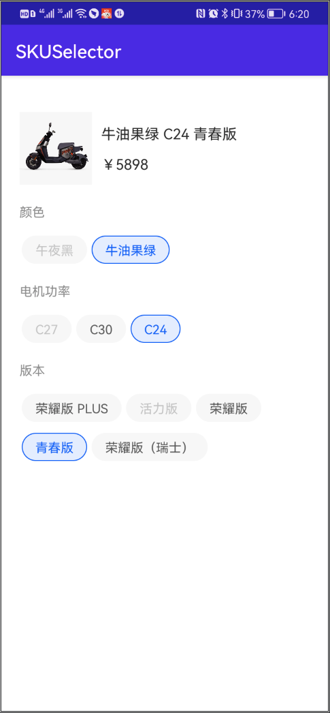

# 分分钟搞定电商SKU算法 Android Kotlin版

按照惯例先上图，我们今天要做的功能就是下面这个熊样子。



## 前言

最近在做公司电商项目的时候需要做类似淘宝、京东的SKU选择功能，本来以为很简单，没想到浪费了一天时间也没搞定。后台在网上找到一篇文章，说是用无向图算法可以搞定，文章的内容看起来也很靠谱，于是我就使用无向图实现了。但是后来发现无向图算法并不完美。当顶点A与顶点C有关联，顶点B与顶点C也有关联，但是顶点A+顶点B+顶点C不属于某个SKU时就会出现虽然这3个属性(不同的三个组)能被全部选中，但是却匹配不到SKU的Bug。如果无向图你不熟悉或则没听懂我说了啥也没关系，因为我们今天不使用无向图，而是使用循环，但是又和网上很多的循环方式不一样，其他的循环方式比较复杂，不容易理解。我们今天的绝对好理解。下面进入正题。

## 第一部分，准备工作

首先我们假设已经拿到了后台给我们的SKU数据，你的数据结构有可能跟我不太一样，不过没有关系，这并不影响我们理解思路。我从后端拿到的SKU数据格式如下：

```json
[
{
    "title":"派电动车  电瓶车 48V30Ah汽车级锂电池  机甲系列Z2战警Pro 赛车版 ",
    "imageUrl":"https://paidian-static-dev.oss-cn-shanghai.aliyuncs.com/0001/attachment/2021/10/e0703211-23ce-42b4-8b2d-38f879f4022a.jpg?height=800&amp;width=800",
    "specsName":"午夜黑 C27 荣耀版 PLUS ",
    "price":"589800",
    "specList":[
    {
        "groupId":"111111",
        "groupName":"颜色",
        "specName":"午夜黑",
        "specId":"1439043456910491648"
    },
    {
        "groupId":"1435861831779352576",
        "groupName":"电机功率",
        "specName":"C27",
        "specId":"1438110276799954944"
    },
    {
        "groupId":"1438029716006109184",
        "groupName":"版本",
        "specName":"荣耀版 PLUS",
        "specId":"1452838916980736000"
    }
    ]
},
{
    "title":"派电动车  电瓶车 48V30Ah汽车级锂电池  机甲系列Z2战警Pro 赛车版 ",
    "imageUrl":"https://paidian-static-dev.oss-cn-shanghai.aliyuncs.com/0001/attachment/2021/10/7649f9fc-02c0-4914-859d-89faf9b034de.jpg?height=800&amp;width=800",
    "specsName":"午夜黑 C27 活力版 ",
    "price":"589800",
    "specList":[
    {
        "groupId":"111111",
        "groupName":"颜色",
        "specName":"午夜黑",
        "specId":"1439043456910491648"
    },
    {
        "groupId":"1435861831779352576",
        "groupName":"电机功率",
        "specName":"C27",
        "specId":"1438110276799954944"
    },
    {
        "groupId":"1438029716006109184",
        "groupName":"版本",
        "specName":"活力版",
        "specId":"1452838916993318912"
    }
    ]
},
{
    "title":"=派电动车  电瓶车 48V30Ah汽车级锂电池  机甲系列Z2战警Pro 赛车版 ",
    "imageUrl":"https://paidian-static-dev.oss-cn-shanghai.aliyuncs.com/0001/attachment/2021/10/6922f5fb-a014-4db3-979a-5d3f8e82111e.jpg?height=800&amp;width=800",
    "specsName":"午夜黑 C27 荣耀版 ",
    "price":"589800",
    "specList":[
    {
        "groupId":"111111",
        "groupName":"颜色",
        "specName":"午夜黑",
        "specId":"1439043456910491648"
    },
    {
        "groupId":"1435861831779352576",
        "groupName":"电机功率",
        "specName":"C27",
        "specId":"1438110276799954944"
    },
    {
        "groupId":"1438029716006109184",
        "groupName":"版本",
        "specName":"荣耀版",
        "specId":"1452838917005901824"
    }
    ]
},
{
    "title":"派电动车  电瓶车 48V30Ah汽车级锂电池  机甲系列Z2战警Pro 赛车版 ",
    "imageUrl":"https://paidian-static-dev.oss-cn-shanghai.aliyuncs.com/0001/attachment/2021/10/8f97a340-2a4a-482a-bae7-6c79b25f9538.jpg?height=800&amp;width=800",
    "specsName":"午夜黑  C30 荣耀版 ",
    "price":"589800",
    "specList":[
    {
        "groupId":"111111",
        "groupName":"颜色",
        "specName":"午夜黑",
        "specId":"1439043456910491648"
    },
    {
        "groupId":"1435861831779352576",
        "groupName":"电机功率",
        "specName":"C30",
        "specId":"1438110276816732160"
    },
    {
        "groupId":"1438029716006109184",
        "groupName":"版本",
        "specName":"荣耀版",
        "specId":"1452838917005901824"
    }
    ]
},
{
    "title":"派电动车  电瓶车 48V30Ah汽车级锂电池  机甲系列Z2战警Pro 赛车版 ",
    "imageUrl":"https://paidian-static-dev.oss-cn-shanghai.aliyuncs.com/0001/attachment/2021/10/18cd39a7-c808-4749-9f3d-e3638e474170.jpg?height=800&amp;width=800",
    "specsName":"午夜黑  C30 青春版 ",
    "price":"589800",
    "specList":[
    {
        "groupId":"111111",
        "groupName":"颜色",
        "specName":"午夜黑",
        "specId":"1439043456910491648"
    },
    {
        "groupId":"1435861831779352576",
        "groupName":"电机功率",
        "specName":"C30",
        "specId":"1438110276816732160"
    },
    {
        "groupId":"1438029716006109184",
        "groupName":"版本",
        "specName":"青春版",
        "specId":"1452838917018484736"
    }
    ]
},
{
    "title":"派电动车  电瓶车 48V30Ah汽车级锂电池  机甲系列Z2战警Pro 赛车版 ",
    "imageUrl":"https://paidian-static-dev.oss-cn-shanghai.aliyuncs.com/0001/attachment/2021/10/52d0a91f-fee0-4d04-9deb-8844143797c5.jpg?height=800&amp;width=800",
    "specsName":"牛油果绿  C30 青春版 ",
    "price":"589800",
    "specList":[
    {
        "groupId":"111111",
        "groupName":"颜色",
        "specName":"牛油果绿",
        "specId":"1439043456981794816"
    },
    {
        "groupId":"1435861831779352576",
        "groupName":"电机功率",
        "specName":"C30",
        "specId":"1438110276816732160"
    },
    {
        "groupId":"1438029716006109184",
        "groupName":"版本",
        "specName":"青春版",
        "specId":"1452838917018484736"
    }
    ]
},
{
    "title":"派电动车  电瓶车 48V30Ah汽车级锂电池  机甲系列Z2战警Pro 赛车版 ",
    "imageUrl":"https://paidian-static-dev.oss-cn-shanghai.aliyuncs.com/0001/attachment/2021/10/d707ac20-f234-4ebb-9079-18ff4da640e4.jpg?height=800&amp;width=800",
    "specsName":"牛油果绿  C30 荣耀版（瑞士）",
    "price":"589800",
    "specList":[
    {
        "groupId":"111111",
        "groupName":"颜色",
        "specName":"牛油果绿",
        "specId":"1439043456981794816"
    },
    {
        "groupId":"1435861831779352576",
        "groupName":"电机功率",
        "specName":"C30",
        "specId":"1438110276816732160"
    },
    {
        "groupId":"1438029716006109184",
        "groupName":"版本",
        "specName":"荣耀版（瑞士）",
        "specId":"1452838917031067648"
    }
    ]
},
{
    "title":"派电动车  电瓶车 48V30Ah汽车级锂电池  机甲系列Z2战警Pro 赛车版 ",
    "imageUrl":"https://paidian-static-dev.oss-cn-shanghai.aliyuncs.com/0001/attachment/2021/10/acdbb70a-80f8-4165-ae84-e83ba565eada.jpg?height=800&amp;width=800",
    "specsName":"牛油果绿 C24 350W  荣耀版 PLUS ",
    "price":"589800",
    "specList":[
    {
        "groupId":"111111",
        "groupName":"颜色",
        "specName":"牛油果绿",
        "specId":"1439043456981794816"
    },
    {
        "groupId":"1435861831779352576",
        "groupName":"电机功率",
        "specName":"C24",
        "specId":"1438110276829315072"
    },
    {
        "groupId":"1438029716006109184",
        "groupName":"版本",
        "specName":"荣耀版 PLUS",
        "specId":"1452838916980736000"
    }
    ]
},
{
    "title":"派电动车  电瓶车 48V30Ah汽车级锂电池  机甲系列Z2战警Pro 赛车版 ",
    "imageUrl":"https://paidian-static-dev.oss-cn-shanghai.aliyuncs.com/0001/attachment/2021/10/275c3eee-8332-4a57-8c65-9eabbc74c42b.jpg?height=800&amp;width=800",
    "specsName":"牛油果绿 C24 荣耀版 ",
    "price":"589800",
    "specList":[
    {
        "groupId":"111111",
        "groupName":"颜色",
        "specName":"牛油果绿",
        "specId":"1439043456981794816"
    },
    {
        "groupId":"1435861831779352576",
        "groupName":"电机功率",
        "specName":"C24",
        "specId":"1438110276829315072"
    },
    {
        "groupId":"1438029716006109184",
        "groupName":"版本",
        "specName":"荣耀版",
        "specId":"1452838917005901824"
    }
    ]
},
{
    "title":"派电动车  电瓶车 48V30Ah汽车级锂电池  机甲系列Z2战警Pro 赛车版 ",
    "imageUrl":"https://paidian-static-dev.oss-cn-shanghai.aliyuncs.com/0001/attachment/2021/10/8097f1f7-92c2-46a8-adcc-622343472fac.jpg?height=800&amp;width=800",
    "specsName":"牛油果绿 C24 青春版 ",
    "price":"589800",
    "specList":[
    {
        "groupId":"111111",
        "groupName":"颜色",
        "specName":"牛油果绿",
        "specId":"1439043456981794816"
    },
    {
        "groupId":"1435861831779352576",
        "groupName":"电机功率",
        "specName":"C24",
        "specId":"1438110276829315072"
    },
    {
        "groupId":"1438029716006109184",
        "groupName":"版本",
        "specName":"青春版",
        "specId":"1452838917018484736"
    }
    ]
},
{
    "title":"派电动车  电瓶车 48V30Ah汽车级锂电池  机甲系列Z2战警Pro 赛车版 ",
    "imageUrl":"https://paidian-static-dev.oss-cn-shanghai.aliyuncs.com/0001/attachment/2021/10/9b9e0aad-f65a-480e-a98a-ca585a3076a6.jpg?height=800&amp;width=800",
    "specsName":"牛油果绿 C24 荣耀版（瑞士）",
    "price":"589800",
    "specList":[
    {
        "groupId":"111111",
        "groupName":"颜色",
        "specName":"牛油果绿",
        "specId":"1439043456981794816"
    },
    {
        "groupId":"1435861831779352576",
        "groupName":"电机功率",
        "specName":"C24",
        "specId":"1438110276829315072"
    },
    {
        "groupId":"1438029716006109184",
        "groupName":"版本",
        "specName":"荣耀版（瑞士）",
        "specId":"1452838917031067648"
    }
    ]
}
]
```

根据上面的json数据我们封装以下数据实体类。

### SKUInfo实体类

```kotlin
data class SKUInfo(
    val price: Long,
    val imageUrl: String,
    val specList: List<SpecInfo>,
    val specsName: String
) 
```

由于我们选择属性后需要判断已选的属性是不是属于某一个sku所以我们为该类封装一个方法，用于判断有些属性是不是属于当前sku。便于扩展我们首先定义一个接口，如下：

```kotlin
interface SKU {
    fun hasSpecs(specs: Collection<Spec>): Boolean
}
```

然后让SKUInfo实体类实现该接口，完整的SKUInfo实体类如下：

```kotlin
data class SKUInfo(
    val price: Long,
    val imageUrl: String,
    val specList: List<SpecInfo>,
    val specsName: String
) : SKU {

    /**
     * 用来判断当前SKU是否由某些属性组成。
     * @param specs 需要判断的属性，这里的参数不一定是当前SKU的全部属性。
     * @return 如果是由spec组成则返回true，否则返回false。
     */
    override fun hasSpecs(specs: Collection<Spec>): Boolean {
        return specList.map { it.specId }.containsAll(specs.map { it.specId })
    }
}
```

### SpecInfo 属性实体类

为了便于工具类的封装和扩展，同样我们也先定义一个Spec接口，代码如下：

```kotlin
interface Spec {
    /**
     * 是否已选中。
     */
    var isSelected: Boolean

    /**
     * 是否可用(非禁用)。
     */
    var isEnable: Boolean
  
    /**
     * 当前属性所属分组的分组ID。
     */
    val groupId: String

    /**
     * 当前属性的ID。
     */
    val specId: String
}
```

然后SpecInfo实体类实现Spec接口。具体代码如下：

```kotlin
data class SpecInfo(
    /**
     * 当前属性分组的ID。
     */
    override val groupId: String,
    /**
     * 当前属性分组的名称。
     */
    val groupName: String,
    /**
     * 当前属性的ID。
     */
    override val specId: String,
    /**
     * 当前属性的名称。
     */
    val specName: String
) : Spec {
    /**
     * 默认是没有选中的。
     */
    override var isSelected: Boolean = false

    /**
     * 默认是可用的。
     */
    override var isEnable: Boolean = true
}
```

至此我们说有的准备工作已经完成。

## 第二部分，SKU算法工具类的封装：SKUSelector算法工具类。

其实，实现sku的核心就是利用属性分组，当用户每次做出选择后就会有且仅有两种可能：

1. 用户选择了有个分组里的属性，有可能选择了一个，也有可能选择了多个(不同的分组)。
2. 用户一个属性也没有选择，如果用户选择了一个属性后又取消了选择，那么这时将没有任何一个属性被选择。

#### 我们先来处理第二种情况，因为种情况最简单，我们只需要将所有的属性置为可用就行了，一行代码就可以处理这种情况。具体代码如下：

```kotlin
/**
 * 处理用户没有选择任何属性时的逻辑。
 */
private fun onSelectedNothing() {
    specList.forEach { it.isEnable = true }
}
```

#### 然后我们再来处理第一种情况，这也是核心。其实这里的原理很简单，我们首先定义一个容器，用来盛放用户已选择了的属性。

```kotlin
/**
 * 用来存放已选中的所有属性。需要保证同一组只能记录一个属性。
 */
private val mSelected by lazy { ArrayList<Spec>() }
```

每当用户选择一个属性时我们就将用户选择的这个属性存放到这个容器中，所以我们的工具类需要对外暴露一个添加属性的方法。不过需要注意的是，每次添加到容器之前我们都需要先将容器内与当前需要添加的属性是同一个组的移除掉。

```kotlin
/**
 * 添加一个已选中的属性。
 */
fun addSelected(spec: Spec) {
    //尝试删除同一组中的已选中的属性。
    mSelected.remove { it.groupId == spec.groupId }?.isSelected = false
    //将当前属性设置为选中状态。
    spec.isSelected = true
  	//将当前选中的添加到已选中的集合中。
    mSelected.add(spec) 
  	//处理每个属性的禁用与可用。
    onSelectedChanged()
}
```

上面方法中的```mSelected.remove { it.groupId == spec.groupId }```remove方法是我为容器扩展的一个方法，用来根据条件移除容器中的元素，如果移除成功则返回移除了的元素，如果移除失败则返回null，具体代码如下：

```kotlin
/**
 * 为MutableList扩展一个根据条件移除元素的方法。
 */
inline fun <E> MutableList<E>.remove(filter: (E) -> Boolean): E? {
    iterator().also {
        while (it.hasNext()) {
            val next = it.next()
            if (filter(next)) {
                it.remove()
                return next
            }
        }
    }
    return null
}
```

每当用户取消选择一个属性时我们就将用户选择的这个属性从容器中移除，所以我们的工具类需要对外暴露一个移除属性的方法。

```kotlin
/**
 * 移除一个已选中的属性。
 */
fun removeSelected(spec: Spec) {
  	//先将要移除的属性置为非选中状态。
    spec.isSelected = false
    if (mSelected.remove { it.specId == spec.specId } != null) {
	      //处理每个属性的禁用与可用。
        onSelectedChanged()
    }
}
```

接下来到了核心步骤了，我们要根据用户已选择了的属性来处理所有属性的是否可用于禁用。其实这里的核心思路与步骤如下（**敲黑板**）：

1. 声明一个临时容器用来存放用户已经选择了的属性。这么做是因为等下我们要对容器内的元素进行修改，防止在修改的过程中影响了用户的选择。

2. 将所有属性循环一遍，每一次循环都先将临时容器中与当前属性在同一组的属性移除，然后将当前属性添加到临时容器中，接着去遍历我们所有的sku，找到能够与我们临时容器中的属性匹配的sku，如果能够找到则当前属性可用，如果找不到则当前属性不可以用。这里稍微有点绕，也就是因为绕才导致我之前走了很多弯路。如果觉得绕的话你可以多读两遍，或则结合下面的代码应该就能懂了(最后我也会给出我封装好的工具类，已经做了抽象处理，能够方便你直接使用)。这一步```onSelectedChanged()```的核心代码如下：

   ```kotlin
   specList.forEach { spec ->
       spec.isEnable = skuList.any { sku ->
           //这里是调用我们之前为SKUInfo封装好的方法，用户判断一个或多个sku是否全部属于这个SKU。
           sku.hasSpecs(
             	//将用户选择了的属性放入到临时容器中。
               mSelected.toMutableList().apply {
                 	//先从临时容器中移除当前循环属性所在组的属性。
                   remove { it.groupId == spec.groupId }
                 	//将当前循环属性添加到临时容器中。
                   add(spec)
               }
           )
       }
   }
   ```

以上两个步骤就是sku选择算法的核心了，```onSelectedChanged()```方法的完整代码如：

```kotlin
/**
 * 核心方法，处理属性选择改变后的选中、禁用逻辑。
 */
private fun onSelectedChanged() {
    if (mSelected.isEmpty()) {
        //如果当前没有选中任何一个属性，则全部属性可以点击。
        onSelectedNothing()
    } else {
        //这里是调用我们之前为SKUInfo封装好的方法，用户判断一个或多个sku是否全部属于这个SKU。
        sku.hasSpecs(
          	//将用户选择了的属性放入到临时容器中。
            mSelected.toMutableList().apply {
              	//先从临时容器中移除当前循环属性所在组的属性。
                remove { it.groupId == spec.groupId }
              	//将当前循环属性添加到临时容器中。
                add(spec)
            }
        )
    }
}
```

## 第三部分，优化。

虽然```onSelectedChanged()```已经可以满足我们的需求，但是其核心还是利用了很多的循环遍历。所以在有些情况下我们可以直接跳过循环，这样就可以减少不必要的循环。那么我们可以从以下两点优化：

1. 当用户只选择了一个属性的时候，其实当前用户所选择的属性所在的组都是可以选择的，所以在所有属性遍历的时候如果当前遍历属性为用户选择的属性所在的那个组就可以直接认定为可用，而无需校验SKU。
2. 如果当前遍历属性为用户已经选择了的属性则也可以直接认定为可用，而无需校验SKU。

根据以上分析，我们```onSelectedChanged()```方法的最终代码如下：

```kotlin
/**
 * 核心方法，处理属性选择改变后的选中、禁用逻辑。
 */
private fun onSelectedChanged() {
    if (mSelected.isEmpty()) {
        //如果当前没有选中任何一个属性，则全部属性可以点击。
        onSelectedNothing()
    } else {
        if (mSelected.size == 1) {
            val selected = mSelected.first()
            specList.forEach { spec ->
                spec.isEnable = spec.isSelected || selected.groupId == spec.groupId || skuList.any {
                    it.hasSpecs(
                        listOf(
                            selected,
                            spec
                        )
                    )
                }
            }
        } else {
            specList.forEach { spec ->
                spec.isEnable = spec.isSelected || skuList.any { sku ->
                    sku.hasSpecs(
                        mSelected.toMutableList().apply {
                            remove { it.groupId == spec.groupId }
                            add(spec)
                        }
                    )
                }
            }
        }
    }
}
```

## 第四部分，完整的SKUSelector工具类。

```kotlin
class SKUSelector(
    /**
     * SKU列表。
     */
    private val skuList: List<SKU>,
    /**
     * 属性列表。
     */
    private val specList: List<Spec>
) {

    init {
        onSelectedNothing()
    }

    /**
     * 用来存放已选中的所有属性。需要保证同一组只能记录一个属性。
     */
    private val mSelected by lazy { ArrayList<Spec>() }

    val selected: List<Spec>
        get() = mSelected.toList()

    /**
     * 添加一个已选中的属性。
     */
    fun addSelected(spec: Spec) {
        //尝试删除同一组中的已选中的属性。
        mSelected.remove { it.groupId == spec.groupId }?.isSelected = false
        //将当前属性设置为选中状态。
        spec.isSelected = true
        //将当前选中的添加到已选中的集合中。
        mSelected.add(spec)
        //处理每个属性的禁用与可用。
        onSelectedChanged()
    }

    /**
     * 移除一个已选中的属性。
     */
    fun removeSelected(spec: Spec) {
        spec.isSelected = false
        if (mSelected.remove { it.specId == spec.specId } != null) {
            onSelectedChanged()
        }
    }

    /**
     * 处理用户没有选择任何属性时的逻辑。
     */
    private fun onSelectedNothing() {
        specList.forEach { it.isEnable = true }
    }

    /**
     * 核心方法，处理属性选择改变后的选中、禁用逻辑。
     */
    private fun onSelectedChanged() {
        if (mSelected.isEmpty()) {
            //如果当前没有选中任何一个属性，则全部属性可以点击。
            onSelectedNothing()
        } else {
            if (mSelected.size == 1) {
                val selected = mSelected.first()
                specList.forEach { spec ->
                    spec.isEnable = spec.isSelected || selected.groupId == spec.groupId || skuList.any {
                        it.hasSpecs(
                            listOf(
                                selected,
                                spec
                            )
                        )
                    }
                }
            } else {
                specList.forEach { spec ->
                    spec.isEnable = spec.isSelected || skuList.any { sku ->
                        sku.hasSpecs(
                            mSelected.toMutableList().apply {
                                remove { it.groupId == spec.groupId }
                                add(spec)
                            }
                        )
                    }
                }
            }
        }
    }
}

/**
 * 为MutableList扩展一个根据条件移除元素的方法。
 */
inline fun <E> MutableList<E>.remove(filter: (E) -> Boolean): E? {
    iterator().also {
        while (it.hasNext()) {
            val next = it.next()
            if (filter(next)) {
                it.remove()
                return next
            }
        }
    }
    return null
}
```